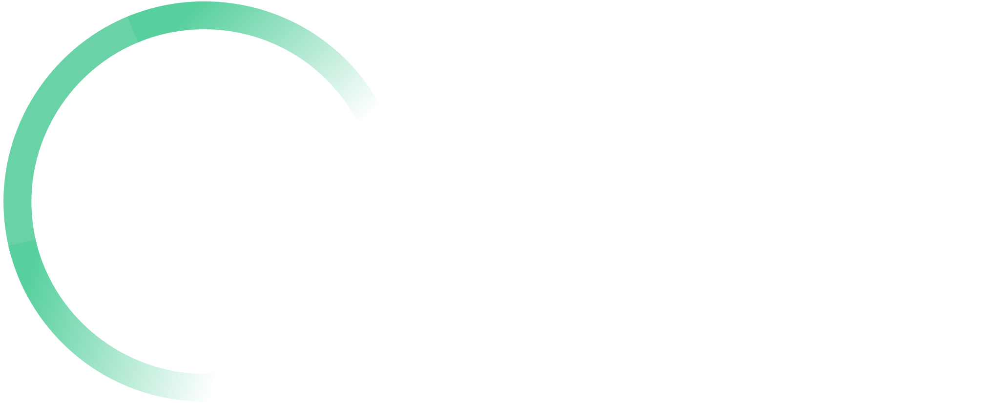
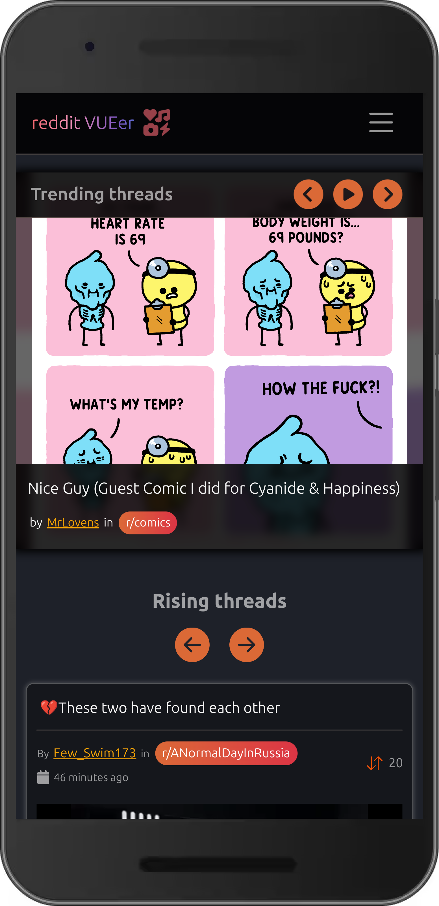
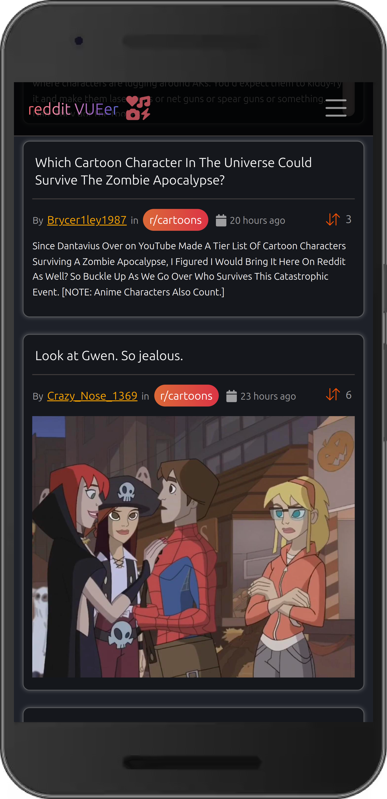
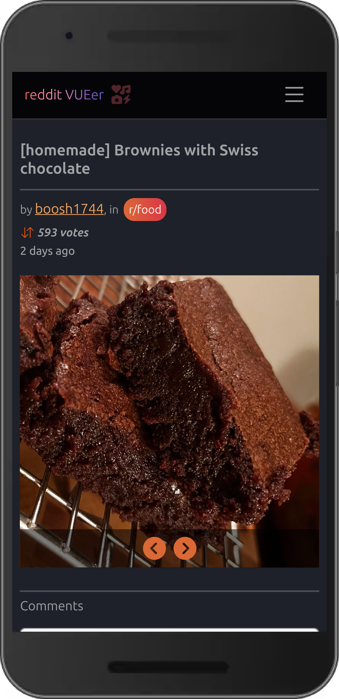
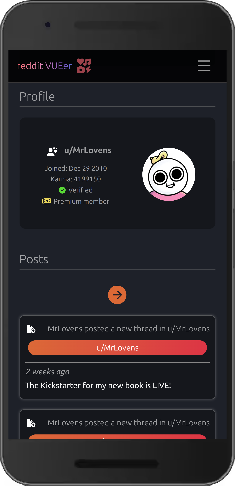
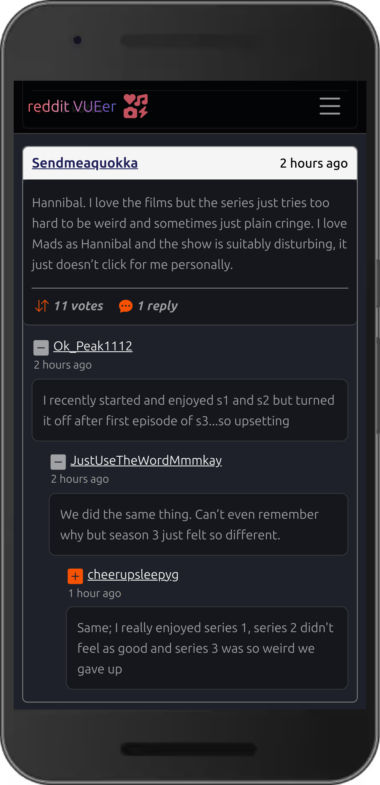
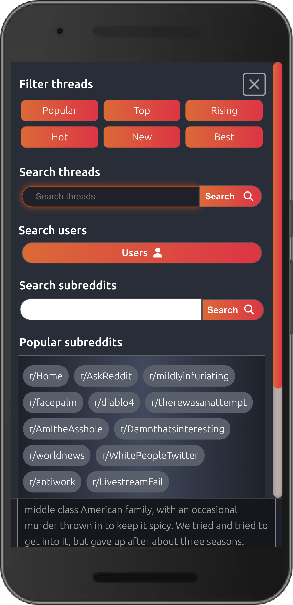

# ***reddit-VUEer*** : a Vue.js & TypeScript project
<p float="left">
  
  &nbsp;&nbsp;&nbsp;&nbsp;&nbsp;
  
  &nbsp;&nbsp;&nbsp;&nbsp;&nbsp;
  
  &nbsp;&nbsp;&nbsp;&nbsp;&nbsp;
   
</p>

This is a Vite-powered project constructed using JSON data from the reddit API. The app allows users to browse, filter and paginate through threads. interact with multimedia content, search for specific threads and subreddits, view comments, search users' profiles and activity, and more. 

> You can visit the app using **[this link](https://vuer.netlify.app)**.

## [The app in action](https://vuer.netlify.app/)
[](https://vuer.netlify.app/)

## Key product features
- Strict type-checking and type-based declarations fully integrated into every part of the app.
- Utilises **composition API** for component setup, hooks and reactivity features.
- Data fetching and asynchronous error handling using the reddit JSON API.
- Includes end-to-end testing with **Cypress** and unit testing with **Mocha + Chai**.
- Extensive use of props, watchers, lifecycle hooks, emitted events and conditional rendering.
- Features recursive components for unknown configurations of deeply nested replies.
- Reusable components and functions with low coupling.
- Vue Router for declarative and imperative client-side navigation.
- Image gallery slideshows animated using Vue transition groups.
- Mobile-first design with an engaging user experience.

## Mobile views

<p float="left">
   
  &nbsp;&nbsp;&nbsp;&nbsp;&nbsp;
   
  &nbsp;&nbsp;&nbsp;&nbsp;&nbsp;
   
  &nbsp;&nbsp;&nbsp;&nbsp;&nbsp;
   
  &nbsp;&nbsp;&nbsp;&nbsp;&nbsp;
   
  &nbsp;&nbsp;&nbsp;&nbsp;&nbsp;
  
</p>

## Running the project in your local environment
### Recommended IDE Setup

[VSCode](https://code.visualstudio.com/) + [Volar](https://marketplace.visualstudio.com/items?itemName=Vue.volar) (and disable Vetur) + [TypeScript Vue Plugin (Volar)](https://marketplace.visualstudio.com/items?itemName=Vue.vscode-typescript-vue-plugin).

### Project Setup
After forking and cloning the repository:
```sh
npm install
```

### Compile and hot-reload for development

```sh
npm run dev
```

### Type-checking

```sh
npm run type-check
```

### Run unit tests with [Cypress](https://www.cypress.io/)

```sh
npm run test:unit
```

### Run End-to-End Tests with [Cypress](https://www.cypress.io/)

```sh
npm run test:e2e:dev
```